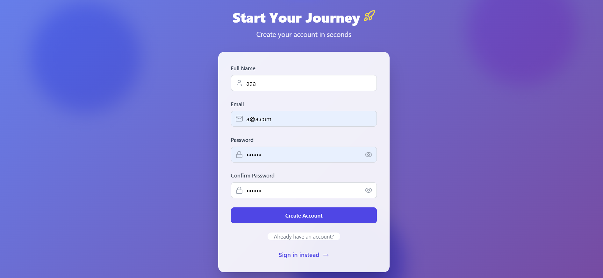
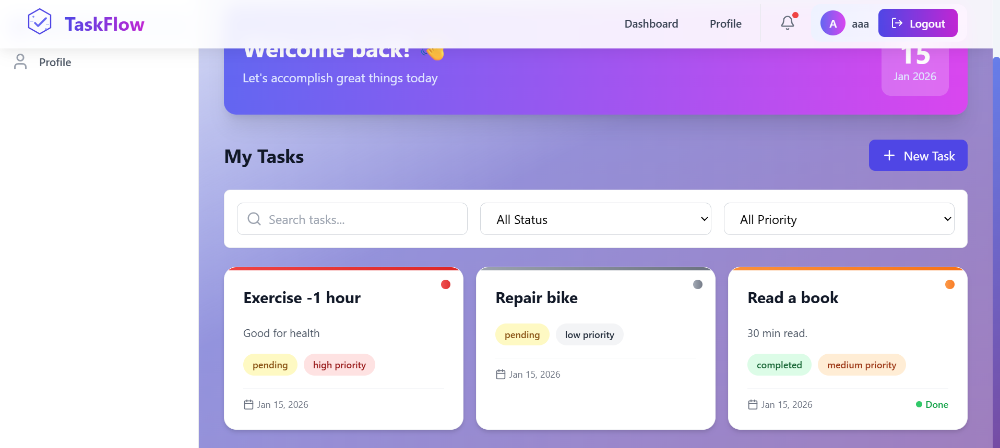
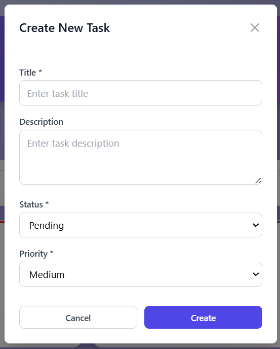
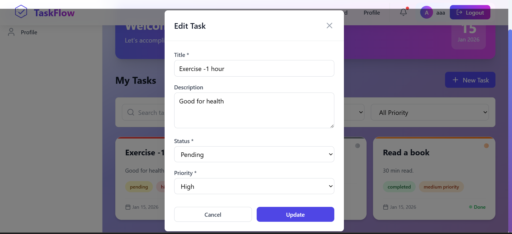
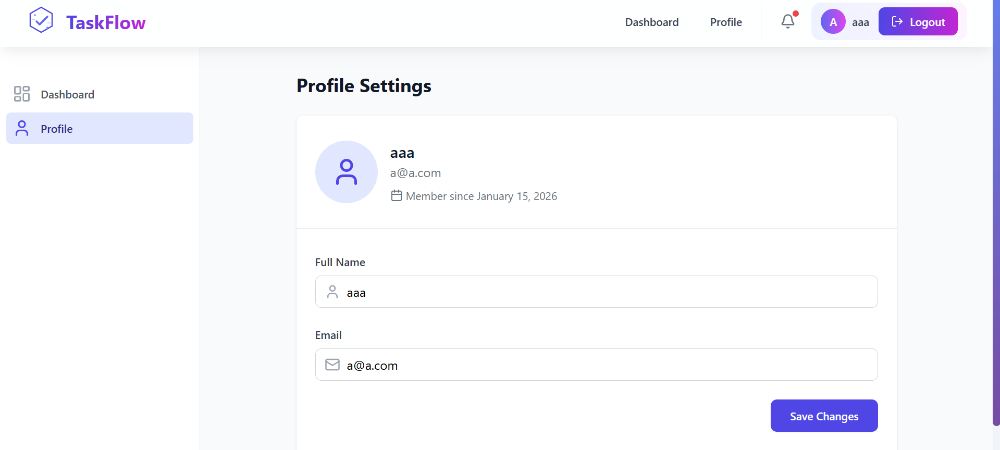
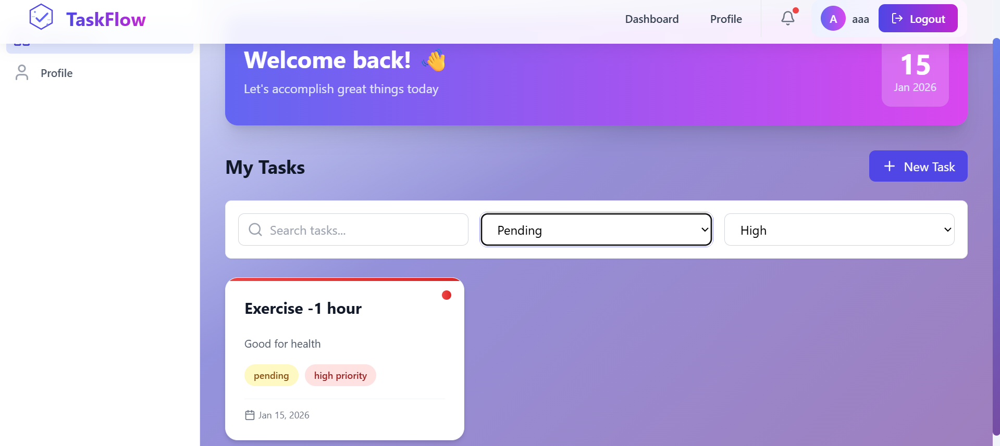
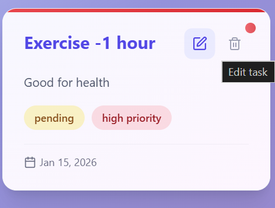

# Task Flow - Task Manager

A full-stack web application with authentication, user management, and task management features. Built with React, Node.js, Express, and MongoDB.
# Setup Instructions

## Frontend

```bash
cd frontend
npm install
npm run dev

## Backend
```bash
cd backend
npm install
npm run dev

##  Features

### Frontend
- **React 18** with Vite for fast development
- **TailwindCSS** for responsive, modern UI
- **React Router** for client-side routing
- **Protected Routes** with authentication guards
- **Form Validation** using React Hook Form + Zod
- **Toast Notifications** for user feedback
- **Responsive Design** - Mobile, tablet, and desktop support

### Backend
- **Node.js + Express** RESTful API
- **JWT Authentication** with bcrypt password hashing
- **MongoDB** with Mongoose ODM
- **Input Validation** with express-validator
- **Error Handling** with custom middleware
- **CORS** enabled for frontend integration

### Security
- Password hashing with bcrypt (10 salt rounds)
- JWT token-based authentication
- Protected API routes with middleware
- Input validation on both client and server
- HTTP-only token storage (can be upgraded)

---

Frontend will run on `http://localhost:5173`

---
## Login Page


## Sign up Page


## Dashboard


## Dashboard containing tasks with different priorities and statuses

## Create New task


## Editing existing task

## Profile settings

## Filtering tasks

## Editing and deleting task



##  API Endpoints

### Authentication
| Method | Endpoint | Description | Auth Required |
|--------|----------|-------------|---------------|
| POST | `/api/auth/signup` | Register new user | No |
| POST | `/api/auth/login` | Login user | No |
| GET | `/api/auth/profile` | Get user profile | Yes |
| PUT | `/api/auth/profile` | Update user profile | Yes |

### Tasks
| Method | Endpoint | Description | Auth Required |
|--------|----------|-------------|---------------|
| GET | `/api/tasks` | Get all tasks (with filters) | Yes |
| POST | `/api/tasks` | Create new task | Yes |
| GET | `/api/tasks/:id` | Get single task | Yes |
| PUT | `/api/tasks/:id` | Update task | Yes |
| DELETE | `/api/tasks/:id` | Delete task | Yes |

### Query Parameters for GET /api/tasks
- `status` - Filter by status (pending, in-progress, completed)
- `priority` - Filter by priority (low, medium, high)
- `search` - Search by task title
- `sort` - Sort order (default: -createdAt)

---

---

##  Features Showcase

### Authentication
- User registration with validation
- Secure login with JWT tokens
- Automatic token management
- Protected routes

### Task Management
- Create tasks with title, description, status, priority
- Edit tasks inline with modal form
- Delete tasks with confirmation
- Real-time search by title
- Filter by status and priority
- Responsive card-based layout

### User Profile
- View user information
- Update name and email
- Display account creation date

---

##  Security Features

1. **Password Security**
   - Passwords hashed with bcrypt (10 salt rounds)
   - Never stored in plain text
   - Password comparison using secure methods

2. **JWT Authentication**
   - Tokens expire after 7 days
   - Token stored in localStorage
   - Automatic token injection in API requests
   - 401 handling with automatic logout

3. **API Security**
   - Protected routes with authentication middleware
   - Input validation on all endpoints
   - Error messages don't leak sensitive info
   - CORS configured for specific origin

4. **Input Validation**
   - Client-side validation with Zod schemas
   - Server-side validation with express-validator
   - Sanitization of user inputs

---

##  Scalability Considerations

### Current Architecture
- Modular component structure
- Separated concerns (services, controllers, models)
- Reusable components and hooks
- Centralized API service layer

### Production Scaling Strategy

#### Frontend
1. **State Management**
   - Upgrade from Context API to Redux Toolkit or Zustand for complex state
   - Implement data caching with React Query or SWR

2. **Performance**
   - Code splitting with React.lazy()
   - Image optimization and lazy loading
   - CDN for static assets
   - Service Worker for offline support

3. **Deployment**
   - Deploy to Vercel or Netlify
   - Environment-specific builds
   - Enable compression and minification

#### Backend
1. **Database**
   - Add indexing on frequently queried fields
   - Implement connection pooling
   - Move to MongoDB Atlas for cloud hosting
   - Setup read replicas for scaling

2. **API Architecture**
   - Implement rate limiting (express-rate-limit)
   - Add Redis for caching and sessions
   - Setup API versioning (/api/v1/)
   - Implement pagination for list endpoints

3. **Security Enhancements**
   - Use HTTP-only cookies for JWT storage
   - Implement refresh token mechanism
   - Add helmet.js for security headers
   - Setup CSRF protection

4. **Monitoring & Logging**
   - Integrate logging (Winston, Morgan)
   - Error tracking (Sentry)
   - Performance monitoring (New Relic, DataDog)
   - Setup health check endpoints

5. **Infrastructure**
   - Containerize with Docker
   - Deploy to AWS/GCP/Azure
   - Setup CI/CD pipeline (GitHub Actions)
   - Implement auto-scaling
   - Load balancing with Nginx

6. **Microservices (Future)**
   - Separate auth service
   - Separate task service
   - Message queue for async operations (RabbitMQ, Kafka)

---

##  Deployment

### Backend (Railway/Render/Heroku)
```bash
# Build command
npm install

# Start command
npm start

# Environment variables
PORT=5000
MONGODB_URI=<your-mongodb-atlas-uri>
JWT_SECRET=<secure-random-string>
JWT_EXPIRE=7d
NODE_ENV=production
CLIENT_URL=<your-frontend-url>
```

### Frontend (Vercel/Netlify)
```bash
# Build command
npm run build

# Output directory
dist

# Environment variables
VITE_API_URL=<your-backend-url>/api
```


---


##  Development

### Code Style
- ES6+ JavaScript
- Async/await for async operations
- Arrow functions
- Destructuring
- Template literals


---
